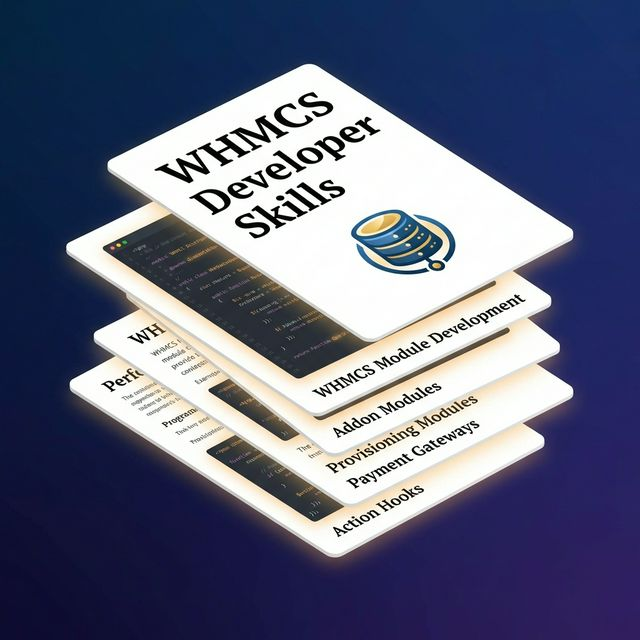

# WHMCS Dev Skills

AI agent skill for professional **WHMCS module development**.  
This skill helps coding agents build and maintain production-ready WHMCS integrations including:

- Addon Modules
- Provisioning (Server) Modules
- Domain Registrar Modules
- Payment Gateway Modules
- Action Hooks and API integrations



## Why This Skill

`whmcs-dev-skills` gives agents a strong, practical instruction set for WHMCS 8.x/9.x work:

- Security-first defaults (input validation, encryption, safe DB patterns)
- Capsule ORM + WHMCS-native conventions
- Hook architecture and module lifecycle guidance
- Production-oriented snippets and anti-pattern prevention

## Who It Is For

- WHMCS plugin/module developers
- Agencies building custom hosting automation
- Teams maintaining registrar/gateway/provisioning integrations
- AI-assisted coding workflows for WHMCS projects

## Install

### Local

1. Copy `SKILL.md` into your agent skills directory.
2. Keep `banner.png` as repository media.

### Example repo clone

```bash
git clone https://github.com/<your-org>/whmcs-dev-skills.git
```

## Skill Metadata

- Skill name: `whmcs-dev-skills`
- License: `GPL-2.0`
- Main file: `SKILL.md`

## SEO Keywords

WHMCS developer skill, WHMCS module development, WHMCS addon module, WHMCS provisioning module, WHMCS payment gateway, WHMCS registrar module, WHMCS action hooks, AI coding skill for WHMCS, WHMCS automation.

## License

This project is licensed under **GNU General Public License v2.0 (GPL-2.0)**.  
See [`LICENSE`](./LICENSE).
